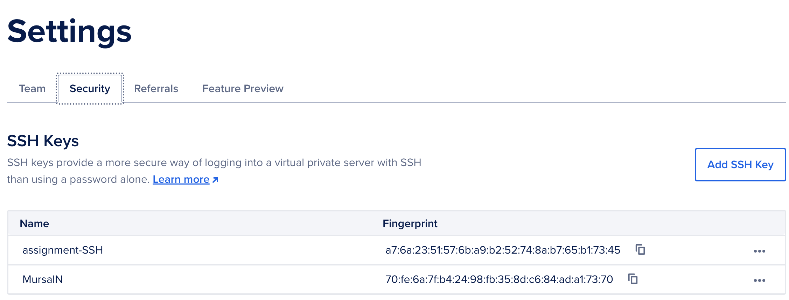
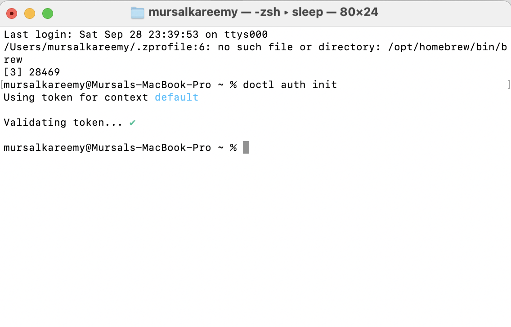
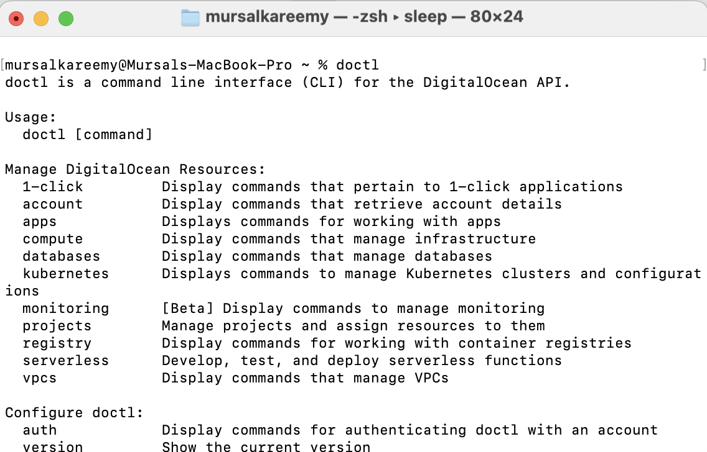
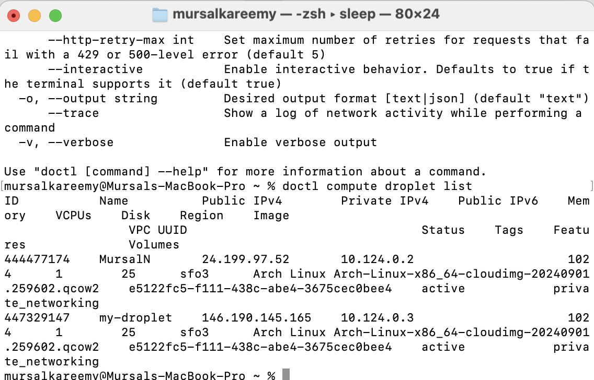

# Setting Up an Arch Linux Droplet Using `doctl` and Cloud-init

## Introduction

This tutorial will guide you through creating and configuring an Arch Linux droplet on DigitalOcean using the `doctl` command-line tool. You’ll also automate the initial server setup using `cloud-init`. By the end, you'll have a remote server with a new user, installed packages, and secure SSH access.

---

## Prerequisites

Before you begin, ensure that you have the following:

- **DigitalOcean Account** with an API token for authentication.
- **SSH Key** generated on your local machine.
- **`doctl` Command-line tool** installed and configured on your machine.
- Basic understanding of the Linux command line.

---

## Step 1: Generate SSH Keys

Start by generating an SSH key on your local machine. This key will be used to securely connect to your droplet.

bash

`ssh-keygen -t rsa -b 4096`

Follow the prompts to save the key to your default directory (usually `~/.ssh/id_rsa`). After that, upload the **public** key to your DigitalOcean account.

1. Copy your public SSH key:
    
    bash
    
    
    
    `cat ~/.ssh/id_rsa.pub`
    
2. Log in to DigitalOcean, go to **Account > Security** and add your key under **SSH Keys**.
    

**Why SSH?**  
SSH keys provide a secure and convenient way to authenticate with servers, removing the need for passwords.

---

## Step 2: Install and Configure `doctl`

`doctl` is DigitalOcean’s command-line tool that allows you to interact with your DigitalOcean account. Install `doctl` using `pacman` on an Arch Linux machine:

bash

`sudo pacman -S doctl`

Next, authenticate `doctl` with your DigitalOcean account:

bash

`doctl auth init`

You’ll be prompted to enter your DigitalOcean API token, which can be created under your API Tokens page.

---

## Step 3: Create a Droplet Using `doctl`

Now that `doctl` is configured, let’s create a new droplet running Arch Linux.

### Command to Create the Droplet:

bash

`doctl compute droplet create my-arch-droplet \   --region nyc3 \   --image arch-linux \   --size s-1vcpu-1gb \   --ssh-keys <your-ssh-key-fingerprint> \   --user-data-file cloud-init.yaml \   --wait`

### Explanation of the Flags:

- `--region`: Choose the region for your droplet (e.g., `nyc3`).
- `--image`: Specifies the image to use (`arch-linux`).
- `--size`: Defines the droplet size (e.g., `s-1vcpu-1gb`).
- `--ssh-keys`: Pass the fingerprint of your SSH key uploaded to DigitalOcean.
- `--user-data-file`: Path to the cloud-init file that automates setup tasks.
- `--wait`: Ensures the command waits for the droplet creation to complete.

You can find your SSH key fingerprint using:

bash

`doctl compute ssh-key list`

---

## Step 4: Automate Server Setup with Cloud-init

With `cloud-init`, you can automate the initial configuration of your droplet, such as creating a user, installing packages, and configuring SSH.

Here’s a basic `cloud-init.yaml` file:

yaml

`#cloud-config users:   - name: newuser     sudo: ALL=(ALL) NOPASSWD:ALL     shell: /bin/bash     ssh-authorized-keys:       - ssh-rsa AAA...your-public-key... packages:   - htop   - git ssh_pwauth: false disable_root: true`

### What this `cloud-init` file does:

- Creates a new user called `newuser` with sudo privileges.
- Adds your SSH public key to the `authorized_keys` file for `newuser`.
- Installs some basic packages (`htop` and `git`).
- Disables root access via SSH for better security.

---

## Step 5: Connecting to Your Droplet

Once the droplet is created, you can connect to it via SSH using the new user account created by `cloud-init`.

1. Find the droplet’s public IP address using `doctl`:
    
    bash
    

    
    `doctl compute droplet list`
    
2. Use the following command to connect:
    
    bash
    
    
    
    `ssh newuser@<droplet-ip>`
    

---

## Conclusion

In this tutorial, you learned how to create an Arch Linux droplet using `doctl`, automate initial server setup with `cloud-init`, and securely connect to your server using SSH. This setup provides a great foundation for building more complex cloud-based applications.

---

## Resources

- [DigitalOcean Documentation](https://docs.digitalocean.com)
- [Cloud-init Documentation](https://docs.cloud-init.io/en/latest/)
- [Doctl Documentation](https://docs.digitalocean.com/reference/doctl/)

---

